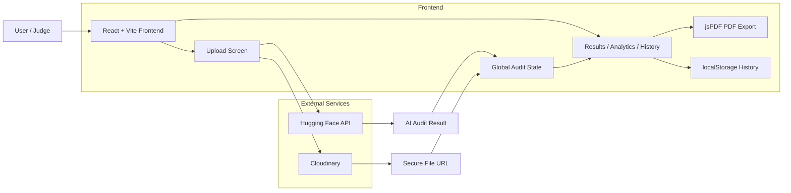

# LabMate Architecture

## Presentation Slide

## Slide Message
LabMate is a React + Vite frontend that uploads protocol files to Cloudinary, sends the file to a Hugging Face AI analysis endpoint, stores audit history in browser localStorage, and generates professional PDF reports with jsPDF.

## Tech Stack Summary
- Frontend: React 18, Vite, CSS, custom hooks
- AI Backend: Hugging Face hosted analysis API
- File Storage: Cloudinary unsigned uploads
- Reporting: jsPDF PDF generation
- Persistence: localStorage for audit history

## Speaker Notes
- The frontend is the main product surface.
- Cloudinary stores the uploaded protocol file securely.
- Hugging Face returns the AI audit result.
- Results are shared across all screens through global React state.
- Users can export the analysis as a PDF report for lab records.
